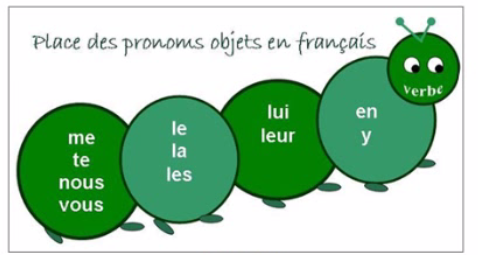

#  France

[ɑ̃] [ε] [ε̃] [ɔ] [ᴐ̃] [ə] [œ] [œ̃] [ø] [ʃ] [ӡ] [ɲ] [ɥ] [ô] [û] à ç è é 

qqch. 某物   ;  qqn. 某人

## 字母(26)

### 元音(6)

* a [a]
* e [ə]
* o [o]
* i [i]
* u [y]
* y [igrεk]

### 辅音(20)

* b [be]

* c [ce]

* d [de]

* f [εf]

* g [ӡe]

* h [aʃ]

* j [ӡi]

* k [ka]

* l [εl]

* m [εm]

* n [εn]

* p [pe]

* q [ky]

* r [εr]

* s [εs]

* t [te]

* v [ve]

* w [dublve]

* x [iks]

* z [zεd]

  


## 音素(35)

### 元音(15)

* [a] 啊	
  
  * [ɑ̃] [a]ng 鼻音化
  
* [i] 衣

* [e] 诶 

* [ε] æ 
  
  * [ε̃] æng 鼻音化 
  
* [u] 乌

* [y] 雨

* [o] ㅓ小口欧

* [ɔ] 大口欧
  
  * [ᴐ̃] [ɔ]ng 鼻音化
  
* [ø] 最小口额(四声)

* [ə] 小口额

* [œ] 额
  
  * [œ̃] œng 鼻音化  , 逐渐被 [ε̃] 取代
  
  

### 辅音(17)

> 浊辅音发二声 , 不送气的清辅音发轻声

* [n] 呢
* [m] 摸
* [l] 勒
* [r] 喝
* [p] 清辅音p , 在元音音素前发b
* [b] 浊辅音b , 发音重b
* [t] 清辅音t , 在元音音素前发d
* [d] 浊辅音d
* [k] 清辅音k
* [g] 浊辅音g
* [f] 清辅音 符
* [v] 浊辅音 发 乌 音 , 口型同f
* [s] 清辅音 斯
* [z] 浊辅音 子
* [ʃ] 清辅音 事
* [ӡ] 浊辅音 日
* [ɲ] 捏

### 半元音 (3)

> 元音的发音特点 , 辅音的使用方式

> 半元音即是元音 , 也是辅音

* [j] 耶
* [w] 窝
* [ɥ] 月


## 音节

* 音素组成音节, 音节比音素大一级, 音标中元音音素的个数就是音节个数
* 开音节 : 以元音结尾的音节
* 闭音节 : 以辅音结尾的音节


## 发音规则

* 词尾的辅音不发音 , 除了 **f , l , r , c , q**

  * 特例 : 其他辅音在结尾发音

    net [nεt] 清洁的

    direct [dirεkt] 直接的

* ss : 两个s在单词中时 , 音素为[s]

* s : 一个s在两个元音字母之间时发 [z]

* 带分音符(两点)的字母单独发音, 不和前后组合发音

* 闭音符 (字母上的二声)

* 开音符 (字母上的四声)

* 长音符 (字母上的帽子)

* 分音符 (字母上的两点)

* 软音符 (字母c下的尾巴)


## 拼读规律

6. a 以及带音符的 a , 单独出现发[a]
7. i 以及带音符的 i , 单独出现发 [i] , 在元音前发 [j]
8. u , 单独出现发 [y] , 在元音前发 [ɥ]
9. l 发 [l]
10. m 发 [m]
11. n 发 [n]
12. r 发 [r]
13. h , 不发音
14. b , 发浊辅音[b]
15. p  发清辅音[p]
16. d , 发浊辅音[d]
17. t  发清辅音[t]
18. f 发清辅音[f]
19. v ,发浊辅音[v]
20. e
    1. é ,发[e]
    2. 以 er 和 ez 结尾词中 e 发 [e]
    3. es , ed 和 eds 在少数词词末发 [e]
    4. e 在词首的 desc- , dess- , ess- , eff- 中时发 [e]
    5. 其他带音符的e, 单独出现发[ε]
    6. e 发 [ə] 的情况
       1. e在单音节词的词尾 , 如 de
       2. e在单词第一个音节且该音节为开音节
    7. e位于词尾不发音
    8. e字母出现在闭音节中时 , 发[ε]
    9. 单词 et和ect (包括带音符的e) 结尾时 , 直接发 [ε] , 特例 direct [dirεkt]
    10. 单词 est (英语中的is)  直接发 [ε]
21. eu , œu 大多发 [œ]
22. eu , œu 在词末开音节中发 [ø]
23. eu 出现在音素 [z] , [t] , [d] 前时发 [ø]
24. 少数 eu 出现在 [r] 时发 [ø] , 例euro[øro]欧元 , Europe[ørɔp]欧洲
25. 字母组合 ueil 在字母 c 或 g 后面时发 [œj] , 例 accueil [akœj] 接待, orgueil [ɔrgœj] 骄傲
26. emm / enn 在单词中间出现时 e 发 [a]
27. emm / enn 在词首发 [ɑ̃m]/[ɑ̃n]
28. 音素符合  元辅e辅元 格式时 , e 不发音 , 例子 Catherine [katrin] 凯瑟琳
29. 音素符合 辅辅e辅 格式时 , e 发 [ə] , 例子 mercredi [mεrkrədi] 星期三 
30. s , ss 大多发 [s]
31. 单独的s 在两个元音字母之间时 发 [z]
32. z 发 [z]
33. x 大多发 [ks]
34. ex+元音 位于词首 , x 发 [gz]
35. 一些表示数字的词中 , x 发 [s]
36. j 发 [ӡ]
37. 联诵: 在同一节奏组中 , 前一个单词以不发音的辅音字母结尾且 后一个单词以哑音h或元音字母开头时 , 不发音的辅音字母与后面的元音字母组成音节发音
    * 例子 : C`est a moi. 这是我的 [sε-ta-mwa]
    * C`est 与 后面元音字母开头的单词一般要联诵
    * s , x 在发生联诵时发 [z]
    * d 在联诵时发 [t] , 因为后面接元音 , 所以发浊化的[t]  
    * 如果联诵时前面以鼻音结束 , 那么保留鼻音 , 复制一个辅音和后面联诵 , 例 mon ami[mᴐ̃-nami]我的朋友
    * 形容词 bon , 以及以 -ein , -ain , -yen 结尾的形容词在联诵时失去鼻音
    * 字母 f 在连音时 发 [v]
    * 后面单词以哑音h开头时才发生联诵或连音 , 以嘘音h开头不连音不联诵 , 嘘音h在字典中以*标识
38. 连音 : 前一个单词结尾的音素和后一个单词开头的音素连起来发音
39. o 大多发 [ɔ]
40. o在词末开音节中时 , 发[o]
41. o在音素[z] 之前发 [o]
42. ô , 发[o]
43. y在词中位于辅音后发 [i] , 充当元音
44. y在词首且后面跟元音 , 发[j] , 充当辅音
45. y在词中且前后都是元音时, 拆分为 i+i , 前面的i和前面的元音组合发[i] , 后面的i和后面的元音组合发[j]
46. c大多发 [k]
47. c 在e,i,y 前发 [s]
48. ç 永远发 [s]
49. g 大多发 [g]
50. g 在e,i,y 前发[ӡ]
51. k 发 [k]
52. q 大多发 [k]
53. qu 发 [k]
54. w 发 [w] , 常见于外来语 , 特例 wagon[vagᴐ̃]车厢
55. ai/ei 发 [ε]
56. aim/ ain /ein 发 [ε̃] , 但是后面还有元音或m/n, 那么不发[ε̃] , 而是 [ε] + n/m与后面元音组合发音
57. in/ im / ym / yn 发 [ε̃] ,  但是后面还有元音或m/n, 那么不发[ε̃] , 而是 [ε] + n/m与后面元音组合发音
58. um / un 发 [ε̃] , 但是后面还有元音或m/n, 那么不发[ε̃] , 而是 [ε] + n/m与后面元音组合发音
59. an / am / en / em 发 [ɑ̃] , 特例 examen[εgzamε̃]考试
60. om / on 发 [ᴐ̃]
61. ou 发 [u]
62. eau 发 [o] , eau[o]水
63. au 发 [o] , 但是在 r 前发 [ɔ]
64. ch 大多发 [ʃ] , 辅音前发 [k]
65. cc 在 a , u , o 前发 [k]
66. cc 在 e , i , y 前发 [ks]
67. gu 发 [g]
68. ge 发 [ӡ]
69. gn 发 [ɲ]
70. ph 发 [f]
71. mn 发 [n]
72. oi , oe , oê  发 [wa]
74. oin 发 [wε̃]
75. 词尾的 il 在元音后发 [j]
76. 词尾的 il 在辅音后发 [i]
77. ill 在元音后发 [j]
78. ill 在辅音后发 [ij] , 特例 ville[vil]城市 , mille[mil]千 , village村庄 , Lille里尔
79. ti 前无 [s] 时 , 发 [si] 或 [sj] , 其中如果ti后接元音音素时 , 就发 [sj]
80. ti 前为 [s] 时 , 发 [tj]
81. tion 发 [tjᴐ̃] 或 [sjᴐ̃]
82. 词尾的 tier , tié , tième 中 , ti 发 [tj]
83. sion 前是辅音字母时 , 发 [sjᴐ̃]
84. sion 前是元音字母时 , 发 [zjᴐ̃]
85. 字母 i/y/é+en 在词末时 , en 发 [ε̃]
86. 省音 : 少数以元音字母结尾的单音节词 , 常和下一个单词的词首元音(包括h后面的元音) 合读成一个音节, 而省去词末的元音字母, 并用省文撇 ' 代替
    1. 常见的会省音的单音节词 : je , le , me
    2. 例子 je me appelle -> je m'appelle
    3. 例子 le hiver -> l'hiver


## 语法

----

### 量词

0. zéro 
1. un/une     第一: premier,ère 
2. deux        第二: deuxième (阴阳同形) / second,e
3. trois         第三: troisième ( 从三开始, 序数词都是结尾加 ième , 如果结尾是e则去掉e再加这个 )
4. quatre
5. cinq         第五: cinquième 特殊情况,为了发音多加一个u
6. six
7. sept
8. huit
9. neuf          第九: neuvième 特殊情况,为了发音把f变为v
10. dix
11. onze
12. douze
13. treize
14. quatorze
15. quinze
16. seize
17. dix-sept
18. dix-huit
19. dix-neuf
20. vingt    [21~29中第一个词尾的 t 都要发音]
21. vingt et  un / vingt et une
22. vingt-deux
23. vingt-trois
24. vingt-quatre
25. vingt-cinq
26. ...


30. trente
31. trente et un / trente et une
32. trente-deux
33. trente-trois
34. trente-quatre
35. trente-cinq
36. ...


40. quarante
41. quarante et un / quarante et une
42. quarante-deux
43. quarante-trois
44. quarante-quatre
45. quarante-cinq
46. ...


50. cinquante
51. cinquante et un / cinquante et une
52. cinquante-deux
53. cinquante-trois
54. cinquante-quatre
55. cinquante-cinq
56. ...


60. soixante
61. soixante et un / soixante et une
62. soixante-deux
63. soixante-trois
64. soixante-quatre
65. soixante-cinq
66. ...


100. cent

200. deux cents 

300. trois cents

400. quatre cents

500. cinq cents  [q不发音]


> cinq , six , huit , dix 后面单词以辅音开头时, 这几个单词结尾的辅音不发音
>
> ```
> cinq livres 五本书
> quarante-cinq jours 四十五天
> ```


> 当数字做表语表示某个量级时 , 前面加 de
>
> ```
> Le prix du voyage au Maroc est de 500€.
> 去Maroc旅行的费用是500欧元.
> ```
>


> 整百中的cent要加s , 不整百中的cent不加s
>
> ```
> deux cents 200
> deux cent cinquante 250
> ```


#### 时间

> heure n.f. 小时
>
> ​	相当于hour		

> Il est + 时间 
>
> ```
> Il est onze heures quarante-cinq. 11:45
> ```

> Quelle heure est-il? 现在几点?
>
> ​	quel 哪个 , 这里的quelle是阴性形式
>
> 十二小时制:
>
> ​	早上8点 : huit heures du matin 
>
> ​	le matin 早上
>
> ​	晚上8点 : huit heures du soir
>
> ​	le soir 晚上 
>
> ​	下午2点 : deux heures de l'après-midi
>
> ​	l'après-midi 下午
>
> ​	正午12点 : midi
>
> ​	午夜12点 : minuit
>
> * sept heures et demie 七点半
>
>     demi n.m. 一半 , heure 是阴性的 , 这个词也跟着变阴性
>
>     midi et demi 正午十二点半 , midi是阳性 , demi就保持阳性


#### 日期

> 7月14日 : le 14 juillet
>
> 5月1日 : le 1^er^ Mai ( 一号都要使用 premier , 1^er^是它的缩写 )
>
> 今天是4月1号 : 
>
> ​	Aujourd'hui, c'est le 1^er^ avril.
>
> ​	或
>
> ​	Nous sommes le 1^er^ avril.
>
> * Quelle date sommes-nous? 今天日期是多少?
> * Nous sommes le 23 août. 今天是八月23号.

一月 janvier

二月 février  

​	情人节 la Saint-Valentin

三月 mars [mars]

四月 avril

五月 mai

六月 juin [ӡuε̃]

七月 juillet

八月 août [ot]

九月 septembre

十月 octobre

十一月 novembre

十二月 décembre


####  一周

周一 lundi   月亮日 la Lune

周二 mardi 火星日 le Mars

周三 mercredi 水星日  le Mercure

周四 jeudi 木星日 le Jupiter

周五 vendredi 金星日 la Vénus

周六 samedi 土星日 le Saturne

周日 dimanche 太阳日 le Soleil

* 表示 ' 本周 ' , 不需要加冠词

    ```
    Je vais à la bibliothèque mercredi. 这周三我去图书馆.
    ```

* 加定冠词 le 时表示 ' 每周 '

    ```
    Je vais à la bibliothèque le mercredi. 我每个周三去图书馆
    ```

    


### 介词prép

#### voici

```
这就是(here is)
```

#### à 

* 在...地方 (in) 

> 侧重的是哪个地方
>
> à la maison. 在家.

```
(in), 接地方
je suis à Tahiti. 我在大溪地.
```

*  在...时间(at)

> 也可接时间
>
> à midi . 在中午12点.

* 表所属

```
Ce sac est à moi.这个包是我的(强调是我的)
```

* 加入...的

```
deux crêpes au sucre 两个加了糖的可丽饼
café au lait 欧蕾咖啡(加了牛奶的咖啡)
```

* ...味的

```
macaron au chocolat 巧克力味的马卡龙
```

* 表用途

```
la salle à manger  饭厅
la machine à laver 洗衣机
la tasse à café 咖啡杯
```

* 在方向( 表示在参照物之外的那个方向上 )

  ```
  L'Espagne est au sud de la France. 西班牙在法国的南边
  ```

  


#### en 

* **用在国家之前作为介词(该国家为阴性)**

> 侧重的是哪个地方

> en 用在阴性国家前 , 表示 在 , 同时省略 la

```
en Chine. 在中国.
```

> 在阳性的国家前:
>
> ​	国家名以辅音开头时 , 用介词 à , 并且 à 和定冠词 le 缩合成 au
>
> ```
> au Japon. 在日本.
> ```
>
> ​	国家名以哑音h或元音开头时 , 用 en 并省略冠词
>
> ```
> en Allemagne. 在德国.
> ```
>
> 在复数国家前 :
>
> ​	用介词 à , 并且 à 和定冠词 les 所合成 aux 
>
> ```
> aux Etats-Unis. 在美国.
> ```
>
> 

* **乘坐(交通工具)  除了 à pied步行 / à vélo骑自行车 / à moto骑摩托** 

    ```
    en train 坐火车
    ```

* **在...时间内 , 在 .. 期间**

    ```
    en trois jours. 用三天的时间;在三天的时间内
    ```

* **用**

    ```
    je paie en espèces. 我用现金支付.
    ```

    


#### dans 

* 在...里

> 表示位置, 方向, 场所
>
> 侧重的是一个地点里

```
dans un café 在一家咖啡馆里面
au café 在咖啡馆
```

* 在...时间后

```
dans 15 minutes. 在15分钟以后
```

* 在方向 ( 表示在参照物的里面)

  ```
  Lyon est dans le sud de la France. 里昂在法国的南部.
  ```

  


#### de (of , from) 的

```
viens de... 来自...(这里de相当于from)
```

#### avec (with) 和, 伴随

```
Les stagiaires travaillent avec le prof de danse. 这些练习生在舞蹈老师的陪伴下工作.
```

#### après (after) 在...之后

```
après le travail. 在工作之后
```

#### chez ...家

```
Nous allons chez Pierre. 我们去皮埃尔家里.
chez moi. 在我家
chez toi. 在你家
```

#### pour (for) 为了

#### pendont (during) 在...期间

#### vers 向着

#### sous 在...下面

```
suis la pluie. 在雨中.
```

#### entre 在...之间

#### par 通过 (by)

```
Je paie par chèque. 我用支票支付.
```

#### sauf 除了 (except)

#### sans 没有(without)

#### sur关于(about)

```
un recherche sur le chômage. 关于失业的研究
```


### 方位介词(属于介词)

将方位介词单独拿出来对比

##### dans 在...里

> Le hamster est dans la boîte. 仓鼠在箱子里.

##### sur 在...表面

> le hamster est sur la boîte. 仓鼠在箱子上.

##### sous 在...下面

> le hamster est sous la boîte. 仓鼠在箱子下面

##### devant 在...前面(空间)

> avant 在...之前(时间)
>
> avant mon anniversaire  在我生日之前
>
> le hamster est devant la boîte. 仓鼠在箱子前面

##### derrière 在...后面

> le hamster est derrière la boîte. 仓鼠在箱子后面

##### à côté de 在...旁边

> le hamster est à côté de la boîte. 仓鼠在箱子旁边

##### à gouche de 在...左边

> le hamster est à gouche de la boîte. 仓鼠在箱子左边

##### à droite de 在...右边

> le hamster est à droite de la boîte. 仓鼠在箱子右边

##### 指路

>  aller tout droit 直走

jusque 直到

feux 火, 红绿灯

> jusqu'aux feux 直到红绿灯

traverser v.穿过

> vous traverser le parc. 您穿过这个公园

tourner v.转弯

> vous tournez à droite. 您往右转
>
> vous tournez à gauche. 您往左转. 


### 连词conj

#### et 和(and)

#### jusqu'à 直到(util)

#### quand 当...时 (when)

#### donc 

* 那么
* 因此 , 所以

#### pour 因为

```
Il est en prison pour meurtre. 他入狱了因为谋杀.
```

#### il y a + 时间 : ...以前

```
J'ai commencé à étudier la langue française il y a cinq ans. 
我五年以前就开始学法语了.
```


### 冠词

#### 不定冠词

* un 阳

* une 阴

* des 复数

* de : 如果复数形容词放在名词前面 , 不定冠词 des 要用 de 代替

    ```
    de belles lampes 一些漂亮的灯
    ```

    

#### 定冠词(the)

* le 阳性
* la 阴性
* les 复数

#### 缩合冠词(介词+le)

* 遇到需要省音时省音优先

##### du = de le

> de le 的缩写形式 , de la 不需要缩写

##### des = de les

> de les 的缩写

##### au = à le 

> à le 的缩写形式

##### aux = à les

> Je vais aux toilettes. 我去厕所.
>
> à l'agence de voyage. 在旅行社. (优先省音)

#### 部分冠词

> 用于 不可数名词 或 抽象名词

* 阳性单数 : du
* 阴性单数 : de la
* 复数 : des
* 在元音为首的单词或哑音h为首的单词前 : de l'

```
faire du ski. 滑雪.
faire de la natation. 游泳.
du pain 面包
de la viande 肉
des légumes 蔬菜
de l'argent 钱
de l'eau 水
du courage 勇气
de la patience 耐心
```


### 代词

#### 人称代词 (8+1)

> 泛指代词 : on , 可指代一切 , 我,我们,你们,他们,大家,有人 等等
>
> ​	on 后面的动词都应当为第三人称单数的变位形式

> 重读 : 强调时使用, 相当于me

> 人称代词用在介词后面要使用重读形式 (with me)

* je 我 | moi 重读
* tu 你 | toi 重读
* vous 您,你们 | vous 重读 
* il 他 | lui 重读
* elle 她 | elle 重读
* nous 我们 | nous 重读
* ils 他们 | eux 重读
* elles 她们 | elles 重读

```
Je m'appelle... 我叫...
Tu t'appelles... 你叫...
Vous vous appelez... 您叫...

Je m'appelle comment? 我叫什么?
```

> 动词要根据人称进行变位, 这里的 ''叫'' 就根据人称发生了不同的变化
>
> comment 疑问副词, ''怎么样''

#### 疑问人称代词qui ( who )

```
Qui est-ce? 这是谁 (Who is this)
```

> est (是) être 的第三人称变位
>
> ce 这个,那个 (this)

#### ce(this)

* 阳性单数 : 
    * ce [sə]  一般用这个
    * cet 当名词为元音开头或哑音h开头时用这个
* 阴性单数 : cette [sεt]
* 复数 : ces [se]

```
C'est Jacques Cartier. 这是卡第耶.
```

> C'est 这是 , 为 ce 和 est 的省音形式

### 名词

> 名词分阴阳性 ,  名词的阴阳性与生俱来 
>
> 身份职业的名词可变阴性 , 结尾加 e 

> 1. **一般名词复数加 s**  
>
> 2. **如果名词以 s , x , z 结尾, 那么变为复数不需要再加 s**
>
> 3. **以al  , ail 结尾的名词变复数 , 把 al , ail 变为 aux**
>
> ​	特例: festival 狂欢节 -> festivals
>
> 4. **以au , eu , eau结尾的名词变复数 , 结尾加 x**
>
> ​	例如 : eau 水 -> eaux 水域
>
> 5. **以 ou 结尾的名词变复数 , 一般是结尾加s**
>
> ​	只有7个特例 : 
>
> ​		bijou -> bijoux 珠宝
>
> ​		caillou -> cailloux 小石子
>
> ​		chou -> choux 卷心菜
>
> ​		genou -> genoux 膝盖
>
> ​		hibou -> hiboux 猫头鹰
>
> ​		joujou -> joujoux 玩具
>
> ​		pou -> poux 跳蚤 

> 阴性复数则词尾是 es

* nom m. 姓

* prénom m. 名

* professeur = prof 老师 m.f.

* travail m. 工作 

* avoin 飞机 m.

* montre 手表 f.

* voiture 汽车 f.

* parfum 香水 m.

* pause 暂停 f.

* nouvelle f. 新闻,新鲜事

* envie f. 意愿

    > avoir envie  de ... 想要...
    >
    > avoir envie de faire inf.  想要做某事

    ```
    Je n'ai pas envie de danser.我不想跳舞
    ```

* animal n.m. 动物 

    >  复数 : animaux

* matinée f. 早上(强调一整段早上的时间)

    > dans la matinée 在早上的时间里

* matin 早上(强调早上这个时间点)

    > au matin 在上午

* soir m. 晚上(时间点)

* soirée  晚上(时间段)

* jour 一天(时间点)

* journée 一天(时间段)

    > dans la journée 在一天的时间里

* an 一年(时间点)

* année 一年(时间段)

    > dans une année 在一年的时间里


###### ...店

名词+erie

> la crêperie  煎饼店
>
> la boulangerie  面包店

### 动词

#### 变位

> 变位中 他们/她们 的 -ent 都不发音

> Ⅰ第一组动词 : 以 er 结尾 
>
> ​	变位去掉 -er , 换成如下
>
> ​		我 : -e
>
> ​		你: -es
>
> ​		您: -ez
>
> ​		他/她 :  -e
>
> ​		我们: -ons
>
> ​		他们/她们: -ent ( 这里的ent不发音 )
>
> Ⅱ 第二组动词 : 以 ir 结尾
>
> ​	变位去掉 ir , 变为如下
>
> ​		je : is
>
> ​		tu : is
>
> ​		il : it
>
> ​		elle : it
>
> ​		nous : issons
>
> ​		vous : issez
>
> ​		ils : issent (ent不发音)
>
> ​		elles : issent (ent不发音)
>
> ​		过去式 : i 

> Ⅲ 第三组变位 : 不规则变位

##### *Ⅲ be动词 être: 是*

* je suis 我是
* tu es 你是
* vous êtes 您是
* il est 他是
* elle est 她是
* nous sommes 我们是
* ils sont 他们是
* elles sont 她们是
* été

```
La mer est belle. 大海十分地美丽.
mer n.f.大海(阴)
```


##### s'appeler: 叫(名字)

* je m'appelle
* tu t'appelles
* il s'appelle
* elle s'appelle
* vous vous appelez

> 这里变位时重复 l 是为了发音更加顺畅, 否则 元辅e辅元 会使其发音改变


##### parler: 说

* je parle
* tu parles
* il parle
* elle parle
* vous parlez
* nous parlons
* ils parlent
* elles parlent


##### regarder : 看

* je regarde 我看
* tu regardes 你看
* il regarde
* elle regarde
* vous regardez 您看


##### aimer: 喜欢

* j'aime
* tu aimes
* il aime
* elle aime
* vous aimez


##### habiter: 住在

* j'habite
* tu habites
* il habite
* elle habite
* vous habitez
* nous habitons
* ils habitent
* elles habitent

> J'habite à Paris. 我住在巴黎.


##### chanter: 唱歌

##### travailler: 工作

##### arrêter: 停止

##### écouter: 听

##### rester: 留在

* 复合过去式使用 être 做助动词

##### déjeuner  吃早/午饭

##### dîner  吃晚饭


##### répéter: 重复

> 在变位时音节发生变化为的是读起来顺畅

* je répète
* tu répètes
* il répète
* elle répète
* nous répétons
* vous répétez
* ils répètent
* elles répètent


##### préférer: 更喜欢

* je préfère
* tu préfères
* il préfère
* ells préfère
* nous préférons
* vous préférez
* ils préfèrent
* elles préfèrent


##### jouer : 玩

* je joue
* tu joues
* il joue
* elle joue
* nous jouons
* vous jouez
* ils jouent
* elles jouent

> 不及物动词
>
> jouer à ... 玩...

```
jouer au football. 玩足球
jouer au basket-ball. 玩篮球
jouer au volley-ball. 玩排球
jouer au badminton. 玩羽毛球
```


##### manger: 吃

* je mange
* tu manges
* il mange
* elle mange
* nous mang<u>e</u>ons  : 这里多加了一个e为了g的发音保持为 [ӡ] (g在e前发[ӡ]) , 此外以ger结尾的动词都要这样变
* vous mangez
* ils mangent
* elles mangent

```
一般吃都是不可数, 使用部分冠词 du/de la/des
manger du pain. 吃面包
manger de la viande. 吃肉
manger des légumes. 吃蔬菜
```


##### rentrer 回来

##### entrer : 进入

* je entre
* tu entres
* il entre
* elle entre
* nous entrons
* vous entrez
* ils entrent
* elles entrent
* 复合过去式使用 être 做助动词


##### payer 付钱

- je paie
- tu paies
- il paie
- elle paie
- nous payons
- vous payez
- ils paient
- elles paient


##### Ⅱ choisir 选择

* je choisis
* tu choisis
* il choisit
* elle choisit
* nous choisissons
* vous choisissez
* ils choisissent
* elles choisissent
* choisi


##### Ⅱ finir 完成

* je finis
* tu finis
* il finit
* elle finit
* nous finissons
* vous finissez
* ils finissent
* elles finissent
* fini


##### Ⅱ asseoir 坐 (有两种变位)

> 两种变位仅仅形式不同, 意义和用法完全相同

1. 

* j'assois
* tu assois
* il assoit
* elle assoit
* nous assoyons
* vous assoyez
* ils assoient
* elles assoient

2. 

* j'assi<u>eds</u> [e]
* tu assieds
* il assied
* elle assied
* nous asseyons
* vous asseyez
* ils asseyent
* elles asseyent


##### Ⅲ prendre 吃, 喝 , 拿起 , 乘坐=take

* je prends
* tu prends
* il prend
* elle prend
* nous prenons
* vous prenez
* ils prennent
* elles prennent
* pris,e

- 吃早饭/午饭/晚饭要用这个 prendre

    ```
    prendre le petit-déjeuner. 吃早饭
    ```

- 乘坐

    ```
    prendre le métro 乘坐地铁
    prendre la voiture 乘坐汽车
    ```

* 带上

    ```
    prendre les chiens. 带上狗 
    ```

    


##### *Ⅲ faire: 做*

* je fais
* tu fais
* il fait
* elle fait
* nous faisons
* vous faites
* ils font
* elles font
* fait

> faire < du/de la/des> ...   做... 


##### Ⅲ écrire: 写

* j'écris
* tu ècris
* il ècrit
* elle ècrit
* nous ècrivons
* vous ècrivez
* ils ècrivent
* elles ècrivent
* écrit


##### Ⅲ lire: 读

* je lis
* tu lis
* il lit
* elle lit
* nous lisons
* vous lisez
* ils lisent
* elles lisent
* lu


##### *Ⅲ avoir: 有 (have)*

* j'ai [ӡe]
* tu as
* il a
* elle a
* nous avons
* vous avez
* ils ont
* elles ont
* eu [y] 雨

> J'ai  une grande voiture. 我有一辆大汽车. 
>
> ​	这里形容词放在了名词的前面
>
> Nous avons une grande maison. 我们有一座大房子.


##### *Ⅲ aller: 走, 进行, 去(go)*

* je vais [ve]
* tu vas [va]
* il va
* elle va
* nous allons
* vous allez
* ils vont
* elles vont
* allé

> elles vont à Paris. 
>
> Tu vas bien? 你过得还好吗?
>
> Ça va? 过得还好吗?(口语) 
>
> ​	Ça 在口语中指代一切 , 为第三人称

```
aller 
	-au cinéma 去电影院
	-au théâtre 去戏剧院
	-aux concerts 去音乐会
```


##### *Ⅲ venir : 来*

* je viens
* tu viens
* il vient
* elle vient
* nous venons
* vous venez
* ils viennent
* elles viennent
* venu

> venir de... 来自...

```
je viens de Chine. 我来自中国(省略定冠词la)
```


##### Ⅲconnaître: 知道, 认识

* je connais
* tu connais
* il connaît
* elle connaît
* nous connaissons
* vous connaissez
* ils connaiss~~ent~~
* elles connaiss~~ent~~ 

> Je connais La France. 我知道法国.


##### Ⅲ apprendre 学习

* j'apprends
* tu apprends
* il apprend
* elle apprend
* nous apprenons
* vous apprenez
* ils apprennent
* elles apprennent
* appris


##### Ⅲ comprendre: 懂得, 明白

* je comprends
* tu comprends
* il comprend
* elle comprend
* nous comprenons
* vous comprenez
* ils comprenn~~ent~~
* elle comprenn~~ent~~
* compris

> Elle comprend le français. 她懂法语.
>
> Vous comprenez l`allemand? 您懂德语吗?
>
> Ils ne comprennent pas le français. 他们不懂法语.

##### Ⅲ pouvoir : 能够 ( may , can)

* je peux
* tu peux
* il peut
* elle peut
* nous pouvons
* vous pouvez
* ils peuv~~ent~~
* elles peuv~~ent~~
* pu

> vous pouvez chanter une chanson? 您能唱首歌吗?


##### Ⅲ vouloir 想(want)

* je veux
* tu veux
* il veut
* elle veut
* nous voulons
* vous  voulez
* ils veulent
* elles veulent
* voulu

> vouloir + inf. 想做某事

```
je veux chanter. 我想唱歌.
```


##### Ⅲ savoir 知道

* je sais
* tu sais
* il sait
* elle sait
* nous savons
* vous savez
* ils savent
* elles savent

```
Je ne sais pas.我不知道.
```


##### Ⅲ dire 说话

* je dis
* tu dis
* il dit
* elle dit
* nous disons
* vous ditez [ditə]
* ils disent
* elles disent
* dit


##### Ⅲ naître 出生

* 现在时变位不重要 ,因为一般都是用过去式 , 使用 être 助动词
* né


##### Ⅲ mourir 去世

* 现在时变位不重要 ,因为一般都是用过去式 , 使用 être 助动词
* mort


##### Ⅲ dormir 睡觉 

* je dors
* tu dors
* il dort
* elle dort
* nous dormons
* vous dormez
* ils dorment
* elles dorment 
* dormi (avoir)


##### Ⅲ boire 喝

* je bois
* tu bois
* il boit
* elle boit
* nous buvons
* vous buvez
* ils boivent
* elles boivent
* bu


##### Ⅲ attendre 等待

* j'attends
* tu attends
* il attend
* elle attend
* nous attendons
* vous attendez
* ils attendent
* elles attendent


#### 否定

> 否定动词使用 : ne <动词> pas

> ne ... rien 什么东西都没有
>
> ne ... personne 什么人都没有
>
> ```
> Je ne vois rien. 我什么都没看到.
> Je ne vois personne. 我什么人都没看到.
> ```
>
> 


#### 时态

> 时态分为 :
>
> 1. 简单时态 : 只需要动词变位的时态
> 2. 复合时态 : 需要加助动词的时态

##### 最近将来时

> aller + inf.动词不定式(即动词原形)  将要做某事

```
Demain , je vais faire un jogging.明天我要去慢跑.
```

##### 最近过去时

> venir de + inf. 刚刚做完某事
>

```
Hier, je viens de faire une randonnée. 昨天我远足去了.
```

##### 复合过去时( 过去完成时 )

> 一般副词时放到动词后面的, 但是在复合过去时里, 副词放到动词前面

> 1. 助动词 **avoir + 动词的过去分词** ( 这个过去式不需要配合主语加es )
>
> avoir在这里是助动词, 相当于英语过去完成时中的 has/have
>
> 动词的过去分词 : 
>
> * 第一组动词 : 直接把结尾的 er 变为 é
> * 第三组动词 : 不规则变化
>
> 2. 助动词 **être + 动词的过去分词** ( 该词还需要配合主语在结尾加 e阴性单数 或 s复数 或 es阴性复数 )
>
> 对于一些表示状态改变 , 位置移动的不及物动词使用être做助动词
>
> ```
> Je vais au cinéma. 我去电影院.
> -> Je suis allé au cinéma. 我去过电影院了.
> 
> Elles sont venues chez moi. 她们来过我家了.
> -> 这里动词是 venir来 ,所以用étre做助动词
> -> 这里主语不是第一人称 , 而且用étre做助动词, 那么动词使用第三人称复数的变位加了es
> ```
>
> 3. **否定形式**的过去完成时 , ne .. pas 应当使用在 助动词上 , 相当于英语中的 haven't 
>
> ```
> Vous avez mangé? 你吃了吗?
> Non, je n'ai pas mangé. 不,我没吃
> ```
>
> 4. **代动词的复合过去时** :  自反代词 + 助动词 être + 动词过去式
>
>    > 表示被动意义和绝对意义的代动词 : 动词的过去式一定要和主语配合加es之类的
>    >
>    > 表示自反意义和相互意义的代动词 : 动词的过去式看主语的情况选择要不要配合加es
>    >
>    > ```
>    > Elle s'est lavée. 她洗了澡(动作对象是她,所以要加e)
>    > Elle s'est lavé les mains.  她洗了手(动作对象是她的手, 所以不需要加e)
>    > ```
>    >
>    > 
>
>    例子 : se laver
>
>    * je me suis lavé(e)
>    * tu t'es lavé(e)
>    * il s'est lavé
>    * elle s'est lavé(e)
>    * nous nous sommes lavé(es)
>    * vous vous êtes lavé(es)
>    * ils se sont lavé(s)
>    * elles se sont lavé(es)


##### 未完成过去时

**用法** : 

1. 用来谈论回忆或过去的习惯 , 表示过去延续的动作或存在的状态

2. 表示过去一件事正在进行时另一件事突然发生

   ```
   Je faisais mes devoirs quand il a frappé à la porte.
   他敲门的时候我正在写作业.
   ```

3. 两个都用未完成过去时的动作 , 表示在过去这两个动作同时在进行

   ```
   Quand je faisais mes devoirs, mon frère regardait la télévision.
   我做作业的时候,我哥正在看电视.
   ```

   

**与复合过去时比较** : 复合过去时强调已经完成的动作 , 未完成过去时强调过去的状态

**构成**(不管第几组) : 由现在时第一人称复数形式去掉词尾的 -ons , 然后加上对应的词尾构成 

**代动词** : 代动词将其动词部分变位即可

* parler ( nous parlons )

  > je parl<u>ais</u>
  >
  > tu parl<u>ais</u>
  >
  > il parl<u>ait</u>
  >
  > elle parl<u>ait</u>
  >
  > nous parl<u>ions</u>
  >
  > vous parl<u>iez</u>
  >
  > ils parl<u>aient</u>
  >
  > elles parl<u>aient</u>

特例 : être

> j'états
>
> tu étais
>
> il était
>
> elle était
>
> nous étions
>
> vous étiez
>
> ils étaient
>
> elles étaient


#### 代词式动词

> 前面带 se 的就是代词式动词
>
> 这个 se 的意义 :
>
> 1. 代表自己
>
> 2. 代表相互之间的行为 , 主语一般是复数
>
>     ```
>     se rencontrer 相遇
>     rencontrer 遇到
>     
>     se dire bonjour 相互问好
>     ```
>
> 3. 代表被动
>
>     ```
>     se vendre 被卖
>     vendre 卖
>     Ce livre se vend bien. 这本书卖的很好.
>     ```
>
> 4. 什么也不代表 , 就这么用的
>
>     ```
>     s'en aller 走开
>     ```
>
> ***代词式动词的变位 :*** 自反代词和动词都要根据主语进行变位  , 自反代词的变位是固定的
>
> ***代词式动词的否定 :*** 使用 ne pas 加在整个动词的两边

* se coucher 

    > je me couche
    >
    > tu te couches
    >
    > il se couche
    >
    > elle se couche
    >
    > nous nous couchons
    >
    > vous vous couchez
    >
    > ils se couchent
    >
    > elles se couchent

* se dédendre. 放松自己

* se réveiller 醒来

    > réveiller 叫醒

    ```
    je me réveille.我醒来.
    ```

* se lever 起床

    ```
    je me lève. 我起床.
    ```

* se laver 洗自己

    > se laver les mains 洗自己的手

* se brosser 刷自己

    > se brosser les dents 刷牙

* s'habiller 穿衣服(给自己)

    ```
    je m'habille. 我穿衣服.
    ```

* se coiffer 梳头

* se promener 散步

    > promener 带...散步
    >
    > promener un chien 遛狗

* se reposer 休息

##### 代动词的命令式

* 肯定形式 : 自反代词 se 要放在动词后面, 然后用 - 连接, 如果是 te , 变为 toi

  ```
  se lever 起床
  命令式:
  lève-toi!
  levons-nous!
  levez-vous!
  ```

* 肯定形式 : 直接把ne...pas 放到代动词两边

  ```
  ne te lève pas!
  ne nous levons pas!
  ne vous levez pas!
  ```

  


### 形容词(阴阳性,单复数)

#### 放置位置

> 形容词大多放在**名词后面**  
>
> 一些音节短小的形容词放在名词前面 , grand,e 大的 ; petit,e 小的 ;
>
> 有些形容词放到名词前面和后面的意思不一样 , 通常放到后面就是表示具体的意义, 放到前面表示抽象的意义


* 形容词作表语

  ```
  je suis chinois./je suis chinoise. 我是中国人
  ```

* excellent,e  极好的

* quel 哪个, 哪几个

    * 阳性单数 : quel
    * 阴性单数: quelle
    * 阳性复数: quels
    * 阴性复数: quelles
    
* dernier,ère 

    1. 放在名词前面 , 表示 最后的 

        ```
        le dernier soir. 最后一个晚上
        ```

    2. 放在名词后面 , 表示 上一个

        ```
        la semaine dernier. 上周
        ```


#### 五个特殊变位的形容词

    > nouveau 新的(阳性)
    >
    > nouvelle 新的(阴性)
    >
    > nouvel 新的(用在以元音或哑音h开头的阳性单数前)
    
    > beau 漂亮的(阳性)
    >
    > belle (阴性)
    >
    > bel (用在以元音或哑音h开头的阳性单数前)
    
    > vieux 老的
    >
    > vieille
    >
    > vieil
    
    > fou 疯狂的
    >
    > folle
    >
    > fol
    
    > mou 柔软的
    >
    > molle
    >
    > mol

* quelque 某些, 几个

    > quelqu'un = qqn 某人
    >
    > quelque chose  = qqch. 某物

* même  

  * 放到名词前面 : 相同的( the same )

    ```
    le même moment 同一时刻
    ```

  * 放到名词后面 : 本身

    ```
    le jour même 当天
    moi-même 我本人
    ```


#### 变阴性

阳性变阴性

1. 直接词尾加 e 

   本来就以 e 结尾的形容词变阴性时不用变

   以带音调的 e 结尾的形容词变阴性时仍然要加 e

   ```
   je suis contente. 我很开心(女性)
   ```

2. 以 x 结尾的形容词变阴性时 , x 变成 es

3. 以 er 结尾的形容词变阴性时, er 变成 ère

4. 以 f 结尾的形容词变阴性时, f 变成 ve

5. 以 -el, -eil, -en, -on, -et 结尾的形容词变阴性时, 先重复词末的辅音字母再加 e

   ```
   industriel,le adj. 工业的
   ```

6. 其他

   ```
   complet -> complète 完整的
   public -> publique 大众的
   long -> longue 长的
   ...
   ```


#### 复数

> 单数变复数

1. 一般直接加 s

   ```
   红色 rouge -> rouges
   绿色 vert -> verts
   黄色 jaune -> jaunes
   ```

2. 以 s, z, x 结尾的变复数不变

   ```
   chinois -> chinois 中国的
   roux -> roux 红棕色的
   ```

3. 以 -al 结尾的 变成 -aux

   ```
   national -> nationaux
   ```

4. 以 -eau 结尾的加 x

   ```
   beau -> beaux 漂亮的
   ```

>  阴性复数

1. 应当先变阴性, 再变复数

   ```
   des feuilles vertes 一些绿色的树叶
   des feuilles rousses 一些红棕色的树叶
   ```

   


#### 比较级

> A être  [moins | plus | aussi]  形容词 que B
>
> que 是B的代词, 同时有英语中 than 的意思
>
> 该处的形容词词性要和A保持一致
>
> ```
> Le voyage en Italie est moins cher que le voyage au Maroc. 
> 去意大利旅行比去摩洛哥便宜.
> ```
>
> moins 少
>
> plus 多
>
> aussi 一样
>
> * 特殊情况 : bon adj. 好的
>
>  bon的更高比较级为 meilleur,e
>
>  ```
>  A est meilleur que B. A比B好.
>  ```
>
>  


#### 最高级

* le/la/les plus/moin + adj.  + n.   [+ de ... ]  [...里]最...的...

  * 这里的定冠词要配合名词
  * le/la/les 也可使用主有形容词代替(我的,你的)

* 特例 bon adj.好的 

  > le meilleur restaurant 最好的餐馆


#### 主有形容词(...的)

| 人称      | 阳性名词前      | 阴性名词前        | 复数名词前     |
| --------- | --------------- | ----------------- | -------------- |
| je        | **mon** livre   | **ma** voiture    | **mes** amis   |
| tu        | **ton** livre   | **ta** voiture    | **tes** amis   |
| il/elle   | **son** livre   | **sa** voiture    | **ses** amis   |
| nous      | **notre** livre | **notre** voiture | **nos** amis   |
| vous      | **votre** livre | **votre** voiture | **vos** amis   |
| ils/elles | **leur** livre  | **leur** voiture  | **leurs** amis |
|           |                 |                   |                |

* 例外 : 如果ma , ta , sa后面的名词以元音或哑音h开头 , 那么主有形容词要用阳性单数形式 , 是为了发音方便, 可以连音

    ```
    ton amie 你的朋友(女性)
    ```

    


### 副词

> 在直陈式现在时中，副词放到动词或形容词之后
>
> ```
> je dors bien. 我睡眠不错.
> ```
>
> 在复合过去时中 ， 副词放在助动词和动词过去式之间
>
> ```
> j'ai bien dormi. 我睡得很好.
> ```
>
> 

* bien 好地(well)

* très 非常地(very)

* alors 那么(so)

* mais 但是(but)

* juste 仅仅是(just)

* puis 接下来(then)

* comment 怎样,怎么

* si 

    > 是的 (用于否定疑问句的肯定回答)
    
    ```
    Tu n'as pas un changement de train? 你不要换乘火车吧?
    Si, à Lyon.  要的,在里昂
    changer v. 改变
    changer qqch. 改变某人/某物
changer de ... 更换某物
    ```
    
    > 如果 (if)
    
    ```
    si on veut prendre métro , on peut aller à la station de métro.
    如果想要乘坐地铁, 可以去地铁站
    ```
    
* peut-être 也许, 可能

### tout

1. 做泛指形容词

   > 根据修饰的名词的词性有四种变位 tout, toute, tous[tu], toutes
   >
   > 用法: tout + 定冠词 + 名词  :  所有的... ; 整个的...
   >
   > tout le monde 所有人

2. 表示 ' 任何的 '

   > 用法 : tout + 名词 :  任何的...
   >
   > tout homme 任何人
   >
   > en toute occasion  在任何场合

3. 做泛指代词

   > 根据代指的事物的词性有三种变位  tout , tous[tus], toutes
   >
   > Tout va bien 一切都好
   >
   > Dis-moi tout. 告诉我一切
   >
   > C'est tout. 就这样了
   >
   > Je les connais toutes. 她们所有人我都认识

4. 做副词使用 : 非常 , 完全

   > 仅在以 **辅音或嘘音h开头的** **阴性的** 形容词前面时 ,才有性, 数的变化
   >
   > Il est tout content. 他非常开心
   >
   > Elles sont toutes contentes. 她们非常开心


## >>>句型

#### There is / There are...

> il y a ... 有...
>
> il n'y a pas de ... 没有... (这里的de实际上是后面名词的冠词, 称为零数冠词)

```
il y a un chaton dans la tasse. 杯子里有个小猫.
```

> est-ce que = is
>
> il y a = there
>
> que = what
>
> 一般疑问形式:
>
> * il y a une maison? 这里有座房子吗?
> * Est-ce qu'il y a une maison? 
> * Y a-t-il une maison? (倒装形式 , 加 t 是为了发音)
>
> 特殊疑问形式(wwwh):
>
> * Qu'est ce que il y a ? = Qu'est ce qu'il y a ?  这里有什么?  


#### 陈述句 : 主谓宾

```
je parle... 我说
tu parles.. 你说
vous parlez.. 您说

vous parlez français? 您说法语吗?
```

> parler 说
>
> ​	parle (我)
>
> ​	parles (你)
>
> ​	parlez (您)

> français 阳性

#### 陈述句 : 主宾谓

> 如果宾语是人称代词, 那么句子应当是主宾谓结构
>
> 在这个结构中, 宾语的人称代词被称为 **直宾人称代词** 
>
> ```
> je le connais. 我认识他. 
> ```
>
> 如果是否定式, 那么人称代词被加载ne pas 中间 , 代词紧跟动词
>
> ```
> je ne le connais pas. 我不认识他
> ```
>
> **直宾人称代词**
>
> 直宾人称代词也可以代指物
>
> 直宾人称代词用于动词是直接及物动词的情况
>
> * me 
> * te 
> * le/la
> * nous
> * vous
> * les
>
> 1. 在简单时态中 , 直宾人称代词同样放到变位后的动词前面
>
> 2. 在复合时态中 , 直宾人称代词放到助动词之前
>
>    ```
>    Je l'ai appelé(e). 我给他打过电话了.
>    *** 以avoir做助动词的复合时态中 , 如果直宾提到了avoir前面,不管有没有挨着avoir, 那么这个时态中的动词要和宾语配合进行阴阳性单复数的变化 (间宾不需要)*** 
>    例:
>    J'ai mangé les pommes. 我把那些苹果吃掉了.
>    Je les ai mangées.  我把它们吃掉了(苹果:阴性复数, avoir做助动词, 动词配合直宾)
>    
>    例子<双宾的情况>
>    poser des questions à qqn 问某人问题
>    Il pose ces questions à ses professeurs. 他问他的钥匙这些问题
>    Il les leur pose. (问题使用代词les, 他的老师使用代词leur , 根据下图位置定位两个代词)
>    Il les leur a posées. (复合过去式, 使用avoir做助动词, 直宾代词les在avoir前面, 所以动词要配合直宾代词)
>    ```
>
>    
>
> **间接宾语人称代词**
>
> * me
> * te
> * lui
> * nous
> * vous
> * leur
>
> ```
> téléphoner à qqn. 给某人打电话 ( 动词是不及物动词,要用间接宾语动词 )
> Il me téléphone.
> Il te téléphone.
> Il lui téléphone.
> Il nous téléphone.
> Il vous téléphone.
> Il leur téléphone.
> 
> Il me donne un coup de fil. 他给我打电话
> ```
>
> **间接宾语人称代词的否定式**
>
> ne  间宾代词 动词 pas
>
> ```
> Il ne me téléphone pas. 他没给我打电话
> ```
>

*双宾语时代词的位置

***双宾代词时要按照下图进行位置排列***



```
例<1>
donner qqch. à qqn. 把某物给某人
Je donne mes documents au directeur.  
我把我的文件给了经理. (文件是直宾,经理是间宾)
Je les lui donne.  (文件变为代词les, 经理变为代词lui)

例<2>
demander qqch. à qqn. 问某人要某物 
Il demande le numéro de téléphone à fille. 
他问女孩要电话号码 (电话号码是直宾, 女孩是间宾)
Il le lui demande.
(电话号码使用介词 le , 女孩使用介词 lui)

例<3> :  但是 me, te, nous, vous 的位置要在最前面 , 介词要按照上图进行
Il me le demande. 他管我要电话号码.
```


#### 疑问句

* 疑问句的 **倒装语序** 中 , 如果被倒装的动词以 e/a 结尾 , 而且倒装的主语是 il/elle , 那么在倒装之后需要在 动词和主语之间加上 -t- 进行连接, 这样做的目的是防止动词词尾和主语进行连音, 保证动词发音不变.

  >  Que chante-t-elle? 她在唱什么?

##### 一般疑问句

> 一般疑问句 : 可直接用 **是** 或 **否** 来回答的问句 

* **普通语序 : Est-ce que + 陈述句 = 疑问句** **(较为正式)**

> Tu connais la chanson?  你知道这首歌吗? (口语)
>
> Est-ce que tu connais la chanson? 你知道这首歌吗?

* **倒装语序 : 将谓语提到句首**
  * 如果被倒装的主语是代词, 那么倒装后要在谓语和主语之间添加连字符

> Berne est la capitale de la Suisse. 伯尔尼是瑞士的首都.
>
> 倒装疑问->  Est Berne la capitale de la Suisse?  伯尔尼是瑞士的首都吗? 
>
> Vous êtes professeur.  您是老师.
>
> Etes-vous professeur?  您是老师吗?

##### 特殊疑问句

> 普通语序 : (口语形式)
>
> ​	直接使用陈述语序 , 疑问词放到相应的地方
>
> 倒装语序 :(书面形式)
>
> ​	先将谓词提到句首 , 然后将疑问词提到句首, 同英语
>
> est-ce que倒装语序 : (较为正式)
>
> ​	疑问词 + est-ce que + 陈述句

###### qui 谁

> C'est qui?  这是谁?
>
> Qui est-ce? 这是谁? 
>
> Qui est-ce que c'est? (日常中不会用)
>
> C'est Nathalie. 这是Nathalie.

###### que 什么

* que 用做 宾语 或 表语 时变为 quio

> C`est quio?  这是什么? 
>
> Que est-ce?  这是什么?(日常不会用)
>
> ***Qu'est ce que c'est? 这是什么? (一般使用这个)***
>
> C`est un avion. 这是一个飞机.

```
Qu'est-ce que vous aimez? 您喜欢什么?
Qu'est-ce que tu vas faire? 你要去做什么?
```


###### où 哪里

> Il habite où ? 他住在哪里?
>
> Où habite-t-il? 他住在哪里?  
>
> Où est-ce qu`il habite? 他住在哪里?
>
> Il habite à Paris. 他住在巴黎.

###### quel 哪个 

* 做疑问形容词 adj.

> 阳性单数: quel
>
> 阴性单数 : quelle
>
> 阳性复数 : quels
>
> 阴性复数 : quelles

```
Quel livre préférez-vous? 你们更喜欢哪本书?
En quel mois sommes-nous? 现在是几月?
```

* 做疑问代词

> 阳性单数: quel
>
> 阴性单数 : quelle
>
> 阳性复数 : quels
>
> 阴性复数 : quelles

```
Quelle est ta profession? 你的职业是什么?
Quel est ton nom? 你的名字是什么?
```

* 感叹形容词

    ```
    Quelle journée!  == What a day!
    ```

* 问天气

    ```
    Quel temps fait-il ? 天气怎样?
    Il fait + adj. 
    Il fait beau. 天气很好
    Il fait mauvais. 天气不好
    Il fait chaud. 天气很热
    Il fait froid. 天气很冷
    Il + v.i.
    Il pleut. 下雨
    Il neige. 下雪
    Il y a + n.
    Il y a du soleil. 有太阳
    ```

    


###### quand 什么时候

###### comment 怎样

```
Tu vas à la gare comment? 你怎么去车站?
Comment vas-tu? 你最近过得怎么样?
```

###### pourquoi 为什么

> 一般用在句首 , 如果用在句尾前面要加 , 

```
Les poules pondent des oeufs , pourquoi? 为什么鸡要下蛋?
```

> Parce que ... 因为...

###### combien 多少

```
ça fait combien? 多少钱?
ça coûte combien? 多少钱?
Combien de personnes y a-t-il dans la classe? 教室里有多少人?
```

###### A qui 谁的(whose)

```
Ce sac est à moi. 这个包是我的.
A qui est ce sac? 这个包是谁的?
```


#### 命令句

* 只能对 tu , nous , vous使用
* 命令句就是将原本陈述句中的人称代词去掉
* 特例 : 对于第一组动词或变位形式类似于第一组动词的词 , 在 tu 的命令句中 动词使用 第一人称的变位, 即去掉动词结尾的 s

```
tu regardes -> regarde

nous regardons -> regardons

vous regardez -> regardez
```

* 两个特例动词的命令式有变位

    1. étre

        > sois (你)
        >
        > soyons (我们)
        >
        > soyez (你们)

    2. avoir

        > aie 
        >
        > ayons
        >
        > ayez

#### si 引导宾语从句

> 相当于英语中 weather 引导的 宾语从句 , ...是否....

```
他问到: 你是否会来?
Il me demande : Est-ce que tu viens?
使用 si 变成宾语从句 : 他问我是否会来.
Il me demande si je viens.
```


## >>>从句

#### 定语从句

> 使用 qui 作为先行词引导定语从句

eg: 

```
Je connais un garçon.  我认识一个男孩.
Il travaille à la télé.  他在电视台工作.
----> Je connais un garçon qui travaille à la télé. 我认识一个在电视台工作的男孩.
```


## >>>常用短语

> faire attention à ... 注意...

> montrer qqch. à qqn. 向某人展示某物

> décider de faire qqch. 决定做某事

> être le premier à faire.. 是第一个做某事的人

> être au régime 在节食减肥

> prendre la route 上路

> à la fin de ... 在...的结尾 , 后面的名词要加定冠词
>
> en fin de ... 在..的结尾,  后面的名词不需要定冠词
>
> fin n.f. 结尾

> en tout 总共

> beaucoup de ... 很多的...

> un peu de ... 一点的..

> sur la route 在公路上
>
> dans la rue 在街上
>
> dans le boulevard 在大街上

> ça change de ... 和...不一样

> commencer à ... 开始做某事

> ça veut dire que... 也就是说..
>
> ça veut dire quoi ? 这是什么意思呢?

> par ici 在这里(around here)

> il faut  + 动词原形  应该...(这里的il是无人称主语, 谁也不代指)
>
> faut 的动词原形 : fallor 

> à son avis  依某人看
>
> avis n.m. 意见
>
> à mon avis  依我看 (on my option)
>
> à votre avis? 你们怎么看?
>
> être de son avis 同意某人意见 = être d'accord avec qqn. (be agree with sb.)

> mal : 疼
>
> avoir mal à ...  ...疼
>
> avoir mal aux pieds 脚疼 
>
> avoir mal à la tête 头疼

> avoir chaud  感觉热
>
> avoir soif  感觉渴
>
> avoir faim  感觉饿

> avoir besoin de...   需要...
>
> besoin n.m. 需求

> demander v.t.  要求
>
> demander qqch. 询问某物
>
> demander à qqn 要求某人
>
> demander à qqn de faire qqch 要求某人做某事
>
> ```
> Elle demande à son mari de mettre la table.她叫丈夫摆好桌子.
> ```
>

> le printemps 春天
>
> l'été 夏天
>
> l'automne 秋天
>
> l'hiver 冬天
>
> au printemps 在春天
>
> en été 在夏天
>
> en automne 在秋天
>
> en hiver 在冬天
>
> Au printemps, il fait doux. 在春天, 很温暖.
>
> En été , il fait chaud. 在夏天,很热.
>
> En automne, il fait sec. 在秋天很干.
>
> En hiver , il fait froid. 在冬天很冷.

> remplir A de B 用B装满A

> tellement...que... 如此地...以至于...(so...that...)

> plus...plus 越...越...

> téléphoner à qqn. 给某人打电话
>
> donner un coup de fil à qqn. 给某人打电话
>
> donner qqch. à qqn. 给某人以某物
>
> un coup de... 一通/一记
>
> up coup de pied 一脚

> il faut .... 应该...
>
> il 间宾人称代词 faut ...    某人应该...

> ne ... jamais 从不...

> tout à coup / tout d`un coup 突然

> s`intéresser à... 对...感兴趣

> Pas encore. 还没有


## >>>常用短句

```
Excusez-moi.  打扰一下
```

> 中间的 - 为连字符


 Non. 不

```
Oui. 是
```

```
Moi aussi. 我也是
```

> aussi adv. 也


```
Merci. 谢谢
```

```
Bonjour. 早上好,你好
Bon après-midi. 午安
Bonne soirèe. 祝晚上愉快
Bonne nuit. 晚安

```

```
Je viens de ... 我来自...
```

```
Désolé./Désolée. 抱歉
```

> désolé  adj. 感到抱歉的


```
à bientôt. 一会见.
à demain. 明天见.
Salut. 再见
```

```
bien sûr. 当然了.
```

```
Pardon. 打扰一下
```

```
Je voudrais... 我想...(I want to...)
```

```
Tiens. 瞧
```

```
s'il vous plaît. 请. (缩写SVP)
```

```
Ça veut dire... 意思是...  (Ça : 这 , 那)
Ça veut dire quoi? 这是什么意思呢?
```

```
Pas de problème. 没问题
= Il n'y a pas de problème.
```

```
C'est dommage. 真可惜
dommage n.m. 损失
```

```
Moi non plus. 我也不/我也没.
Il ne mange pas et moi non plus. 他没吃我也没吃.
```

```
c'est bizarre. 这很奇怪.
```

```
je suis là. 我在.
```

```
le voilà. 他在那里. there he is.
la voilà. 她在那里. there she is.
```

```
félicitations à tous. 祝贺大家.
```

```
bravo! 好!妙!
```

```
A votre santé.  为了你们的健康干杯
A la musique. 为音乐干杯
A la danse.   为舞蹈干杯
A l'amour.    为了爱情干杯
Tchin tchin. 干杯
```

```
D'après moi,  在我看来
```

```
Chacun son goût. 萝卜白菜 , 各有所爱
```

```
pourquoi? 为什么?
parce que... 因为... (后面单词以元音或哑音h开头要省音连读)
```

```
A plus tard. 稍后见
```

```
Je te laisse. 我先走了(我把你扔下了)
laisser v. 扔下
```

```
Bienvenue! 欢迎!
```

```
ça y est. 好了;完成了
```

```
表示年龄 : avoir 数字 an(s)
他七岁了 Il a sept ans.
```

```
l'addition, s'il vous plaît. 这边麻烦结下账.
```

```
par ici. 这边走.
```

```
A table. 吃饭啦.
```

```
C`est de la part de qui? 请问你是?(电话用语)
```

```
Je vous le passe. 我让他来接电话(电话用语)
```

